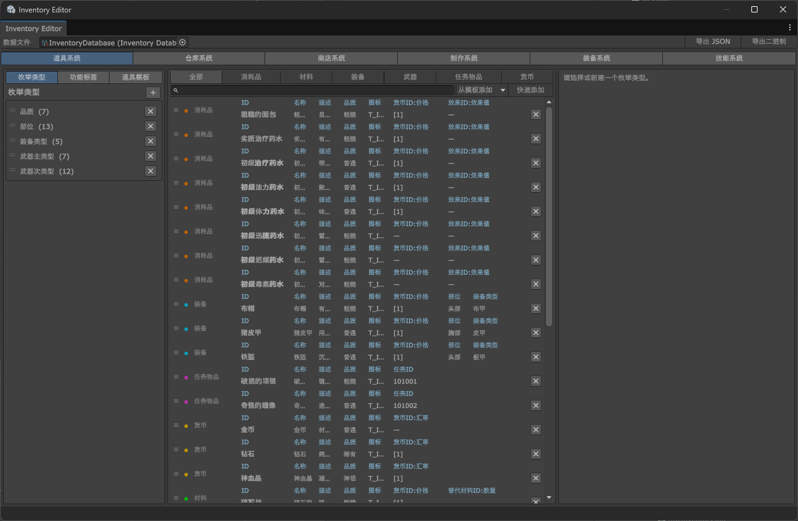
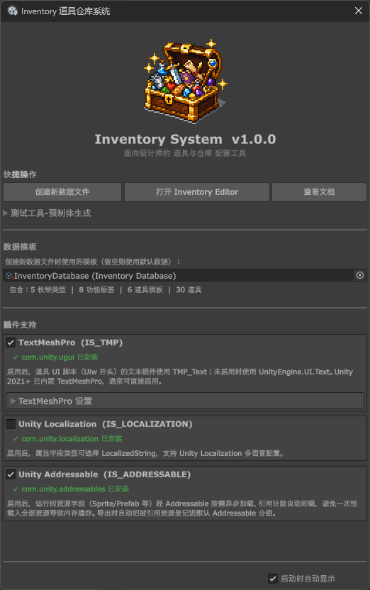

# インベントリシステム（Inventory System）

<p align="center">
  🌍
  <a href="./README.md">中文</a> |
  <a href="./README_EN.md">English</a> |
  日本語
</p>

デザイナー向けの Unity 静的データ設定ツールプラグイン。1 つの `InventoryDatabase` アセットで、**アイテム / 倉庫 / ショップ / クラフト / 装備 / スキル** という 6 つのサブシステムの静的な定義データを一元的に設定します。動的なランタイム状態（所持数、インスタンス ID、取引の進捗、クラフト成果物、装備中アイテム、習得済みスキル、セーブデータ）は、対応するランタイムマネージャーが管理します。そのまま使えるランタイム UI コンポーネント一式（バックパック / ショップ / クラフト / 装備 / スキル画面）も付属します。

- エディタは常に、そして ScriptableObject 上でのみ動作します。JSON / バイナリは一方向のエクスポートフォーマットとしてのみ使われます。
- 全工程で Undo / Redo に対応。
- テキストコンポーネント、ローカライズ、Addressables はいずれもコンパイルマクロで任意に有効化できます。

---

## サブシステム概要



| サブシステム | 設定する内容 | ランタイムマネージャー | 詳細ドキュメント |
|--------|---------|------------|---------|
| **アイテムシステム** | 列挙型、機能タグ、アイテムテンプレート、アイテム + 柔軟な属性 | `InventoryDataManager`（クエリ） | [アイテムシステム](Docs~/ItemSystem_JA.md) |
| **倉庫システム** | 倉庫テンプレート、倉庫、容量/重量/タグ制限、整理ソート | `InventoryRuntimeManager`（スロット状態 + セーブ） | [倉庫システム](Docs~/WarehouseSystem_JA.md) |
| **ショップシステム** | ショップテンプレート、ショップ、商品グループ、価格ソース、更新スケジュール | `ShopRuntimeManager`（取引 + 進捗セーブ） | [ショップシステム](Docs~/ShopSystem_JA.md) |
| **クラフトシステム** | グループタグ、ブループリントテンプレート、ブループリント（レシピ）、クラフト倉庫 | `CraftingRuntimeManager`（消費 → 産出） | [クラフトシステム](Docs~/CraftingSystem_JA.md) |
| **装備システム** | グループタグ、装備グループテンプレート、装備グループ（スロットリスト / 装備スロット / アイテム制限 / 属性ボーナス） | `EquipmentRuntimeManager`（装備 / 解除 + ボーナス + セーブ） | [装備システム](Docs~/EquipmentSystem_JA.md) |
| **スキルシステム** | グループタグ、スキルテンプレート、スキル（カスタム属性が 種類 / 効果 / 数値 / 位階 などを保持） | `SkillRuntimeManager`（習得状態 + セーブ）+ `SkillCollector`（4 ソース収集） | [スキルシステム](Docs~/SkillSystem_JA.md) |

### アイテムシステム
- **柔軟な属性システム**：フィールド型は Bool / Int / Float / String / Text（プレーンテキストのフォールバック + 任意のローカライズ参照）/ Vector2〜4 / VectorInt2〜4 / Color / Enum / StringIntPair / EnumIntPair / Sprite / Texture / Prefab / Material / AudioClip / AnimationClip / AnimationCurve / PhysicsMaterial(2D) に対応し、いずれも配列形式もサポートします。
- **カスタム列挙型**：列挙値はシステムが自動採番（単調増加、再利用は決してしない）。表示順序はドラッグで並べ替え可能。列挙項目はカスタム属性フィールドを持てます。
- **機能タグ**：各タグは一組の属性フィールドを定義します。アイテムへのタグの増減で、対応するフィールドが自動的に増減します。タグはアイテムテンプレートに固定できます。
- **アイテムテンプレート / アイテム一覧 / アイテム Inspector**：テンプレートは作成のひな型になります。一覧はテンプレートフィルタのタグバー + 検索 + ドラッグ並べ替えに対応。Inspector はリアルタイムの ID 重複チェック、ソース別の属性グルーピング、列挙サブ属性の自動展開を行います。

### 倉庫システム
- **倉庫テンプレート / 倉庫インスタンス**：テンプレートは容量、重量上限、格納/取り出し/操作の機能タグ制限、フィルタタグ、整理ソートルール、カスタム属性を定義します。インスタンスはテンプレートから作成され、上書きも可能です。
- **整理ソート**：主ソート「整理リスト」+ 副ソート「整理優先度」。ソートフィールドは アイテム ID / タグ順 / 任意のカスタム属性 から選べます。属性は `EFieldType` に応じて異なる比較ルールを用います（数値は直接比較、ベクトルは大きさで比較、StringIntPair はその Int 値で比較）。各ソートフィールドは 1 つの「整理オプション」に対応し、組み込みの「名称」（`Text`：ソートドロップダウンの表示名）と「無視 ID」（ソート時にスキップするエントリ ID のリスト、既定 0 件）を持ちます。
- **ランタイム**：`InventoryRuntimeManager` が各倉庫のスロットリストを管理し、追加/削除/クエリ/整理/セーブの API と `OnInventoryChanged` イベントを提供します。

### ショップシステム
- **ショップ種類**：販売 / 買い取り / 等価交換（等価交換はプレースホルダー）。
- **価格ソース**：価格はハードコードせず、アイテムの `StringIntPair`（通貨 ID → 価格）属性から取得します。「価格属性ソース」で指定し、さらに商品の価格倍率を掛けます。複数通貨に対応。
- **取引倉庫**：各ショップには一組の倉庫が設定され、通貨の集計、購入品の受け取り、買い取り元、釣り銭の書き込みに使われます。
- **商品グループと更新**：商品はグループ分け（タブ）されます。各グループ / 各商品に更新スケジュール（なし / 毎日 / 毎週 / 毎月 × ゲーム / ローカル / サーバー時間 + 時刻 / タイムゾーン）を設定でき、周期的に「取引可能回数」をリセットします。

### クラフトシステム
- **グループタグ / ブループリントテンプレート / ブループリント**：グループタグは UI のグルーピングとフィルタに使われます（各ブループリントは主 1 + 副複数）。テンプレートはカスタム属性 + 設定の既定値 + テンプレートレベルの整理ソートを定義し、ブループリント作成のひな型になります。ブループリントはレシピ（産出 / 消費アイテムのリスト）を保持します。
- **クラフト倉庫**：倉庫 ID の順序付きリストで、優先度順に材料ソースと産出先として使われます。
- **ランタイム**：`CraftingRuntimeManager` は作成可能回数を計算し、複数のクラフト倉庫をまたいで材料を差し引き、産出物を配置します。連続クラフトの回数、計時、進捗は UI 層が駆動します。

### 装備システム
- **グループタグ / 装備グループテンプレート / 装備グループ**：グループタグは合計属性ボーナスフィールドをグループ分けして表示するために使われます。テンプレートは一連の設定可能項目（スロットリスト + 装備属性フィールド）+ カスタム属性フィールドを保持し、装備グループ作成のひな型になります（作成時にディープコピーされ、以降は独立して編集可能）。装備グループは完全なスロット構造を定義します。
- **スロットリスト / 装備スロット / アイテム制限**：装備グループは複数のスロットリストを含み、各リストは複数の装備スロットを含みます。スロットリストは「機能タグ + 列挙制約」で装備可能アイテムを制限し、装備スロットはさらに「フィルタ条件」（属性の等値）で絞り込みます。判定は **すべて AND** です。
- **属性ボーナス**：「装備属性フィールドリスト」は、どのアイテム属性を装備グループの合計ボーナスに集計するかを指定し、グループタグごとにグループ分けして表示します。
- **ランタイム**：`EquipmentRuntimeManager` は各スロットの装備中アイテムを管理します。装備 / 解除 / 交換は `InventoryRuntimeManager` と連携してアイテムを移動し、スロットの自動検索、ボーナス集計、セーブデータ、`OnEquipmentChanged` イベントを提供します。

### スキルシステム
- **グループタグ / スキルテンプレート / スキル**：グループタグはランタイム UI のグルーピングタブによるフィルタに使われます（各スキルは主 1 + 副複数）。テンプレートはカスタム属性フィールド（スキーマ）+ 一組の「スキル既定情報」（名称 / 説明 / アイコン / グループタグ）を定義し、スキル作成のひな型になります。「テンプレートから追加」で既定情報を新スキルにコピーし、以降は独立して編集可能です。スキルは設定エントリで、ID / 名称 / 説明 / アイコン + カスタム属性値（スキルの種類 / 効果 / 数値 / 位階などは、利用側がカスタム属性フィールド内で attrId を取り決めて保持）を持ちます。
- **アイテム ↔ スキルの関連付け**：スキルは主に装備系アイテムに付与されますが、他のアイテムにも付与できます。アイテムはその「スキル参照属性フィールド」の 1 つ（String、配列可 = 1 アイテムに複数スキル）にスキル ID を格納し、ランタイムではその attrId で解決します。
- **位階（Enum）駆動の表示**：スキルには Enum 型の「位階」属性フィールドを設定できます。その列挙項目（アイテムシステムの「列挙型」で定義）は「名称 / 背景フレーム(Sprite)」などのカスタム属性を持ちます。スキルエントリは位階に応じて対応する「背景フレーム」を表示し、Tooltip は位階の「名称」を表示します（アイテム品質背景の解決チェーンを再利用）。関連する attrId はいずれも UI コンポーネント上で設定可能です。
- **ランタイム**：`SkillRuntimeManager`（軽量シングルトン）は **キャラクター ID → 習得済みスキル ID リスト** として複数キャラクターの習得済みスキルを管理し、`Learn / Forget / HasLearned / GetLearnedSkills / GetSaveData / LoadSaveData` の API と `OnLearnedChanged` イベントを提供します。`SkillCollector` はソース別に表示すべきスキル集合を収集します（重複排除、順序保持）。
- **ランタイム UI**：`UiwSkillView` = タイトル + 検索バー + 主 / 副グルーピングタブ（2 つの AND フィルタ条件、それぞれ「すべて」あり、横スクロール可能）+ グリッド / 順序の 2 表示モードリスト + ホバー詳細ポップアップ（`UiwSkillTooltip`、プレハブは `InventoryRuntimeManager` に設定され、そこからグローバルにインスタンス化）。スキルソースは切り替え可能（下記参照）で、`UiwSkillView` のカスタム Inspector はソースに対応する ID フィールドだけを表示します。
- **4 種類のスキルソース**（`ESkillSource`）：
  - **InventoryDatabase**：データベース内のすべてのスキル（スキルブック / 図鑑）。
  - **Equipment**：ある装備グループの全装備スロットの装備中アイテムが参照するスキル（装備グループ ID を設定）。
  - **Inventory**：ある倉庫内の全アイテムが参照するスキル（倉庫 ID を設定）。
  - **Character**：あるキャラクターが現在習得しているスキル（キャラクター ID を設定、`SkillRuntimeManager` を参照）。

### ランタイムとシリアライズ
- **`InventoryDataManager`**（データクエリのシングルトン）：データベースを登録し、ID でアイテム / 倉庫 / ショップ / ブループリント / 列挙型などをクエリします。`.asset`、JSON、バイナリの 3 種類のソースからの読み込みに対応します。
- **`InventoryRuntimeManager`**（MonoBehaviour シングルトン）：倉庫のスロット状態、整理ソート、セーブデータ、時間注入の入口、カバー UI のルートノード / Layer 設定（ポップアップ / ホバーポップアップ / ドラッグのゴーストアイコンなどはインスタンス化後に指定 Layer を再適用）を担い、データベースを `InventoryDataManager` に登録します。エディタのテストアイテム投入（`autoPopulateOnStart` / `testInventoryId` / `testItems`、`Init` のタイミングで投入、データのみで UI は開かない）と、ワンクリックの「すべての設定表アイテムを追加」（`addAllConfiguredItems` + `addAllItemCount`）を含みます。
- **`ShopRuntimeManager` / `CraftingRuntimeManager` / `EquipmentRuntimeManager` / `SkillRuntimeManager`**（軽量シングルトン）：取引 / クラフト / 装備 / スキルのロジック（装備中状態と習得状態はいずれもセーブ可能、ショップは取引進捗のセーブあり）。スキルの表示集合は別途 `SkillCollector` が 4 種のソースから収集します。
- **エクスポート**：`InventoryDtoMapper` → JSON / バイナリ。オブジェクト参照は AssetGUID として保持され、Addressables による非同期読み込みも任意で可能です。

### UI コンポーネント
`Runtime/UI/` 以下、アセンブリ `Ale.Inventory.UI`、名前空間 `Ale.Inventory.Runtime.UI` にあります。バックパック / ショップ / クラフト / 装備 / スキルのメイン画面と、通貨バー、フィルタバー、ソートバー、ホバーポップアップ、数値カウンター、折りたたみタブなどの再利用可能な共通コンポーネントを提供します。各メイン画面は `UiwViewBase` から派生します：引数なしの `Open()` は基底クラスのテンプレートメソッド（パネルを有効化）で、サブクラスがオーバーライドしてそれぞれの開く処理を実装します。バックパック / 装備 / ショップビューは対象 ID（`inventoryIds` / `groupId` / `shopId`）を Inspector に公開し、既定値をあらかじめ設定できます。

- **統一された仮想スクロールリスト**：「大量のエントリ / アイテムを表示する」すべてのリストは、同じ仮想スクロールエンジンの上に構築されています（基底 `UiwInventoryItemListBase<TData,TCell>` → 汎用 `UiwInventoryGridList` / `UiwInventoryOrderList` → 各システムのリーフ）。**グリッドも順序リストも仮想スクロール**です：可視領域 + バッファのみを描画し、スクロールループで再利用します。グリッドは縦 / 横の 2 方向スクロールに対応し、交差軸の数はビューポートから自動計算されます。倉庫グリッドは仮想スクロール下でもドラッグによる整理・並べ替えに対応します。新システム向けにリストを追加するには、汎用のグリッド / 順序レイヤーを継承し「セルのバインド / クリア」をオーバーライドするだけです。
- **リストのパフォーマンスと体験**（エンジン内蔵）：
  - **差分による増分リフレッシュ** —— 内容変化時、データが変わった可視セルだけを再バインド（ドラッグ入れ替え / スタックは通常 2 セルのみ）。アイコンはちらつかず、スクロール位置も保持されます。
  - **生成 / 割り当てのレート制限**（`spawnPerSecond`、既定 30 個/秒） —— インスタンス化とバインドを複数フレームに分散し、単一フレームのピークによるカクつきやアセット読み込みの詰まりを回避します（「画面を開いた最初のフレーム」の一斉インスタンス化を防ぐ予算上限付き）。
  - **スクロール方向に追従するセルごとのフェードイン** —— セルはビューポートに入る順に出現します（下スクロールは上から下へ、上スクロールは下から上へ）。
- 詳細は [UI コンポーネントガイド](Docs~/UIComponentGuide_JA.md) を参照してください。

---

## 詳細ドキュメント

- [属性システム](Docs~/AttributeSystem_JA.md) — フィールド型リファレンス、`AttributeValue` の取得 / 表示 / ソート比較
- [UI コンポーネントガイド](Docs~/UIComponentGuide_JA.md) — UI コンポーネント、プレハブ作成、機能マクロ、デモウィザード
- [アーキテクチャ](Docs~/Architecture_JA.md) — 設計目標、データフロー、エディタ・ランタイムのアーキテクチャ、拡張ガイド

---

## ウェルカムウィンドウ（Welcome Window）



プラグインの統一入口パネルで、「データ作成 / エディタ起動 / ドキュメント表示 / サンプル生成 / マクロ切り替え」といったよく使う操作を集約しています。Unity セッションで最初の一度は自動的に表示され、いつでも手動で開けます：

```
Tools > Inventory System > Welcome Window
```

ウィンドウは上から順に 4 つの領域に分かれています：

### クイック操作

| ボタン | 説明 |
|------|------|
| 新規データファイルを作成 | 新しい `InventoryDatabase` アセットを作成（下記の「データテンプレート」を設定していればそこからディープコピー） |
| Inventory Editor を開く | 設定エディタのメインウィンドウを開く |
| Addressable ツールウィンドウを開く | （`IS_ADDRESSABLE` 有効時）アセット参照 Object ↔ AssetReference(GUID) の一括相互変換 |
| ローカライズツールウィンドウを開く | （`IS_LOCALIZATION` 有効時）多言語テーブルの生成 / 関連付け、すべての Text フィールドのキーをワンクリック生成 |
| ドキュメントを表示 | システム既定のアプリでこの README を開く |

「**テストツール-プレハブ生成**」の折りたたみを展開：

- **すべて生成（データベース + 全 Prefab）**：完全に動作するサンプル（データベース + 全 UI プレハブ + バックパック / ショップ / クラフト画面 + マネージャー）をワンクリックで生成。
- 下の一覧では**個別のプレハブを生成**できます。依存するプレハブを生成する際は子プレハブも一緒に生成するか確認し、既存アセットの上書き前にも確認します。

### データテンプレート

`InventoryDatabase` をテンプレートに指定すると、「新規データファイルを作成」がそのすべてのデータ（列挙 / タグ / テンプレート / アイテム…）をディープコピーします。空のままなら既定の空データとして新規作成します。パネルには、テンプレートに含まれる列挙型 / 機能タグ / アイテムテンプレート / アイテムの数が表示されます。

### プラグインサポート（コンパイルマクロ切り替え）

3 つのオプションマクロを個別に切り替え、対応する Package が導入済みかをリアルタイムに検出します（未導入のマクロにチェックを入れると確認ダイアログが表示されます）：

| 切り替え | マクロ | 効果 |
|------|----|------|
| TextMeshPro | `IS_TMP` | 有効にすると UI テキストコンポーネントが `TMP_Text` を使用、無効時は `UnityEngine.UI.Text` を使用 |
| Unity Localization | `IS_LOCALIZATION` | 有効にすると `Text` フィールドにローカライズ参照（テーブル + エントリ）を持たせられます。「ローカライズツールウィンドウ」と組み合わせてテーブル作成 / キー生成をワンクリックで行い、多言語に対応 |
| Unity Addressable | `IS_ADDRESSABLE` | 有効にするとランタイムアセットが Addressables 経由でオンデマンドに非同期読み込みされ、参照カウントで自動アンロード。エクスポート時には参照されたアセットが自動登録されます |

- **TextMeshPro** の切り替え下では「デフォルトフォント」を設定でき、ウィザードが Prefab を生成する際にすべての TMP テキストノードに適用されます（空の場合は TMP の既定フォント）。
- **Unity Localization** の切り替え下では「ローカライズフォント」を設定でき、ウィザードが Prefab を生成する際に `InventoryTmpFontEvent` に割り当てられます（同時に `IS_TMP` の有効化が必要）。
- マクロを切り替えたら、反映のために Unity の再コンパイルを待ってください。

### 起動時に自動表示

ウィンドウ下部の「起動時に自動表示」の切り替えで、Unity セッションごとにこのウィンドウを自動で開くかどうかを制御します。

---

## 依存関係

- Unity 2022.3+（`package.json` が宣言する最低バージョン。本プラグインは `Unity 6000.3` で開発・保守しています）
- TextMeshPro（任意、`IS_TMP` マクロ）
- Unity Localization（任意、`IS_LOCALIZATION` マクロ）
- Unity Addressables（任意、`IS_ADDRESSABLE` マクロ）

> 3 つのマクロはいずれも **ウェルカムウィンドウ**（`Tools > Inventory System > Welcome Window`）の「プラグインサポート」領域からワンクリックで切り替えられ、対応パッケージの導入有無も検出します。

---

## クイックスタート

### 1. データファイルを作成

```
Project パネルで右クリック > Create > Inventory System > Inventory Database
```

（またはウェルカムウィンドウの「新規データファイルを作成」から。ウェルカムウィンドウで「データテンプレート」を設定しておくと、作成時にそこからディープコピーします。）

### 2. エディタを開く

- `.asset` を選択し、Inspector 上部の「Inventory Editor で編集」をクリック。または
- メニューの `Tools > Inventory System > Inventory Editor`。

エディタは上部のシステムタブ + 3 カラムレイアウト（左：定義設定 / 中：エントリ一覧 / 右：詳細 Inspector）です。中央のエントリ一覧は「列名ヘッダー + 値」の 2 行レイアウトで、テンプレートフィルタ / 検索、ドラッグ並べ替え、選択後に ↑ / ↓ キーで選択を切り替える操作（画面外なら自動スクロール）に対応します。

### 3. データを設定

「アイテムシステム / 倉庫システム / ショップシステム / クラフトシステム / 装備システム」の各タブを順に設定します。各タブの詳しい操作は、対応するサブシステムのドキュメントを参照してください。

### 4. エクスポート

ツールバーの「JSON エクスポート」または「バイナリエクスポート」（空でない ID 重複がある間はボタンが無効。ID が空白のエントリはエクスポート時に自動でスキップ）。

### 5. ランタイムのセットアップ

シーンに GameObject を作成し、`InventoryRuntimeManager` コンポーネントを追加して、`.asset` を `databases` 配列にドラッグします。ゲーム開始時にデータベースが自動登録され、各倉庫が空の状態で初期化されます。

```csharp
using Ale.Inventory.Runtime;

// 静的データのクエリ
Item item = InventoryDataManager.Instance.GetItem("sword_01");

// ランタイムで倉庫を操作
InventoryRuntimeManager.Instance.TryAddItem("backpack", "sword_01", 1);
bool has = InventoryRuntimeManager.Instance.HasItem("backpack", "sword_01");

// セーブ / ロード
var saveData = InventoryRuntimeManager.Instance.GetSaveData();
InventoryRuntimeManager.Instance.LoadSaveData(saveData);
```

### 6. ワンクリック Demo

**ウェルカムウィンドウ**の「テストツール-プレハブ生成 → すべて生成」で、完全に動作するサンプル（データベース + 全 UI プレハブ + バックパック / ショップ / クラフト画面 + マネージャー）をワンクリックで生成します。[ウェルカムウィンドウ](#ウェルカムウィンドウwelcome-window) と [UI コンポーネントガイド](Docs~/UIComponentGuide_JA.md) を参照してください。

---

## ディレクトリ構成

```
InventorySystem/
├── Runtime/
│   ├── Data/           データモデル（Item / Inventory / Shop / Crafting* / AttributeValue など）
│   ├── Manager/        InventoryDataManager / InventoryRuntimeManager / ShopRuntimeManager / CraftingRuntimeManager / EquipmentRuntimeManager / SkillRuntimeManager / SkillCollector
│   ├── Serialization/  DTO + JSON / バイナリのシリアライズ
│   ├── Assets/         アセット読み込みの抽象化（直接読み込み）
│   ├── Addressables/   Addressables アセット読み込みサポート
│   ├── Localization/   TMP テキスト / フォントのローカライズイベント
│   └── UI/             ランタイム UI コンポーネント（Item / ItemList / Tab / Tool / View / Common）
├── Editor/
│   ├── ItemSystem/     アイテムシステムのパネル
│   ├── InventorySystem/倉庫システムのパネル
│   ├── ShopSystem/     ショップシステムのパネル
│   ├── CraftingSystem/ クラフトシステムのパネル
│   ├── EquipmentSystem/装備システムのパネル
│   ├── SkillSystem/    スキルシステムのパネル + UiwSkillView カスタム Inspector
│   ├── Common/         共通の属性 / 設定ドロワー + ツールウィンドウ基底クラス
│   ├── Addressables/   Addressables アセット参照の移行ツールウィンドウ
│   ├── Localization/   ローカライズツールウィンドウ（テーブル作成 / キー生成）
│   ├── Create/         データファイル作成メニュー
│   └── DemoWizard/     テストデータとプレハブのワンクリック生成
├── Resources/Data/     サンプルデータファイル
└── Docs~/              詳細ドキュメント（このフォルダ）
```
